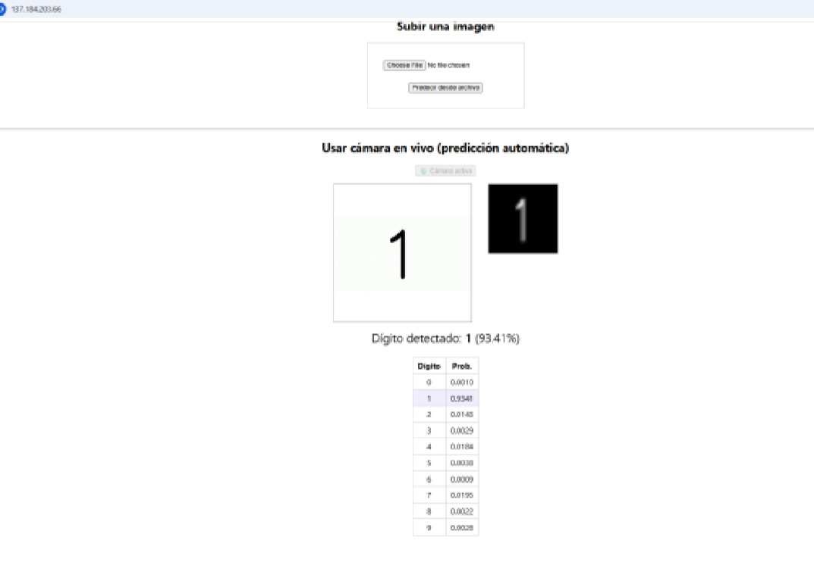
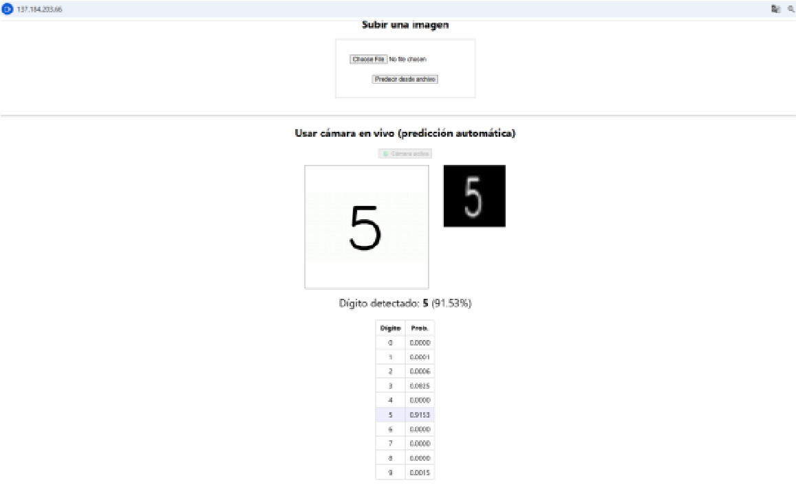
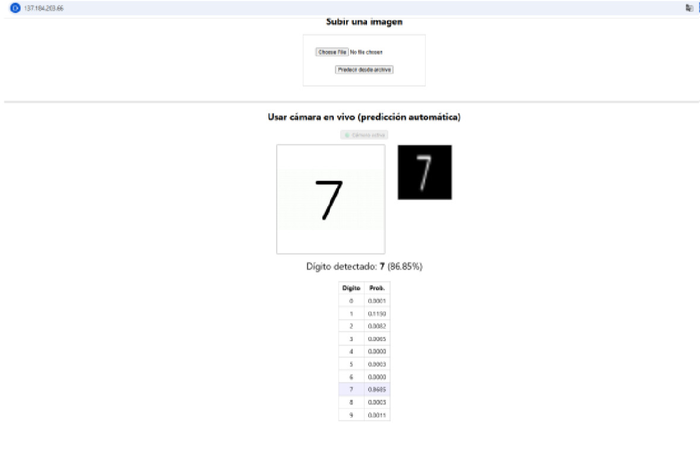
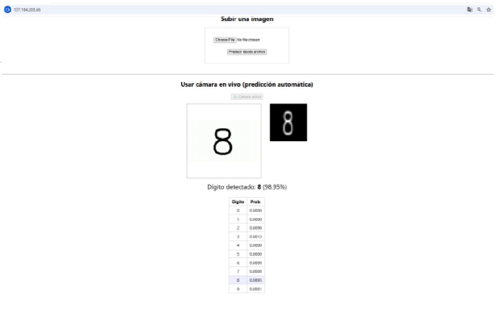
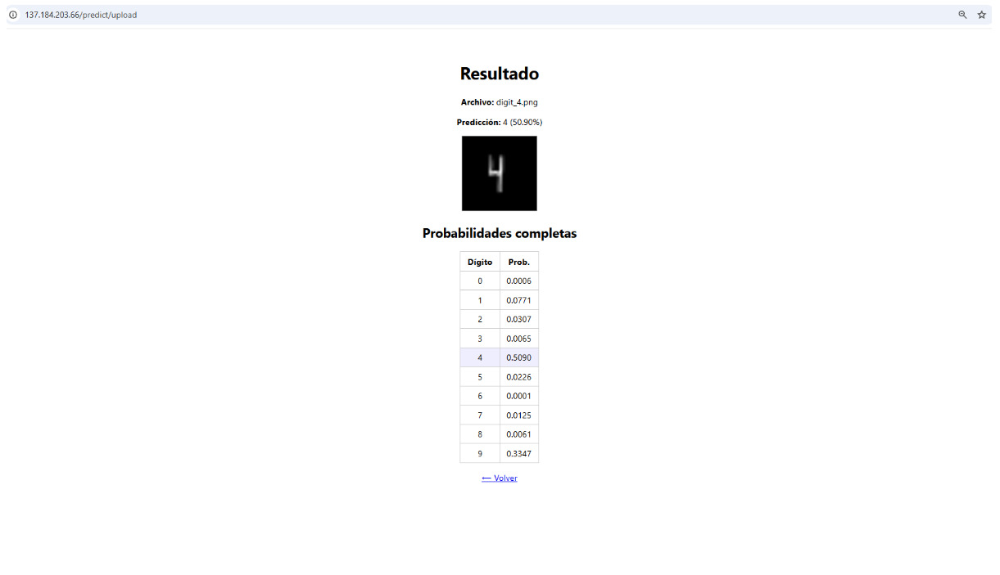

# 🔢 MNIST Digit Classifier – Flask + TensorFlow + Docker

## Desarrollado por Jorge Guillermo Olarte Quispe

## Universidad Nacional del Altiplano – Ingeniería de Sistemas

Aplicación web interactiva que permite predecir dígitos manuscritos (0–9) utilizando una red neuronal convolucional (CNN) entrenada con el dataset MNIST.  
Ofrece dos formas de predicción: subida de imagen y cámara en vivo y ha sido diseñada para ser fácilmente desplegable gracias a Docker + Nginx + Gunicorn.

## Tecnologías y Librerías

- **Backend:** Flask + Gunicorn
- **Modelado:** TensorFlow / Keras
- **Preprocesamiento:** OpenCV, PIL, NumPy
- **Frontend:** HTML + JavaScript (Webcam API)
- **Despliegue:** Docker, Gunicorn, Nginx

## Funcionalidades

- Carga de imágenes (JPG, PNG, JPEG, BMP)
- Predicción automática desde cámara web (capturas cada 2 segundos)
- Modelo CNN entrenado en TensorFlow/Keras
- Previsualización de imagen preprocesada (binaria 28x28)
- Tabla completa con probabilidades por clase
- Despliegue listo para producción con Gunicorn y Nginx

## Modelo CNN

| Propiedad | Valor                           |
| --------- | ------------------------------- |
| Dataset   | MNIST (handwritten digits)      |
| Input     | Imágenes 28×28 en escala gris   |
| Output    | Predicción probabilística (0–9) |
| Accuracy  | ~99% en validación              |

## Vista del Resultado

### Capturas

- Imagen preprocesada (binaria 28×28)
- Predicción del dígito + Probabilidad
- Tabla detallada con todas las clases

| Título             | Resultado Renderizado                 |
| ------------------ | ------------------------------------- |
| Cámara – Dígito 1  |  |
| Cámara – Dígito 5  |  |
| Cámara – Dígito 7  |  |
| Cámara – Dígito 8  |  |
| Archivo – Dígito 4 |    |

## Notas Técnicas

- El preprocesamiento incluye:
  - CLAHE para realce de contraste
  - Umbral de Otsu + binarización adaptativa
  - Redimensionado a 28×28 px + inversión binaria
- Toda la inferencia es in-memory, no se almacenan archivos.

## Licencia

Este proyecto tiene fines académicos y educativos.  
Modelo entrenado con el dataset MNIST, el cual es de uso libre.
